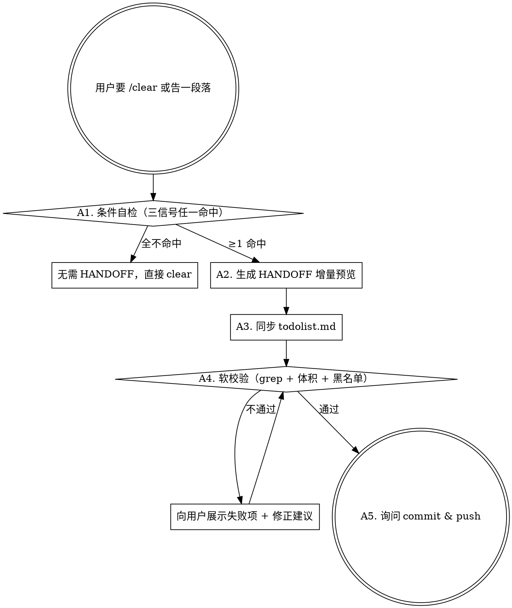
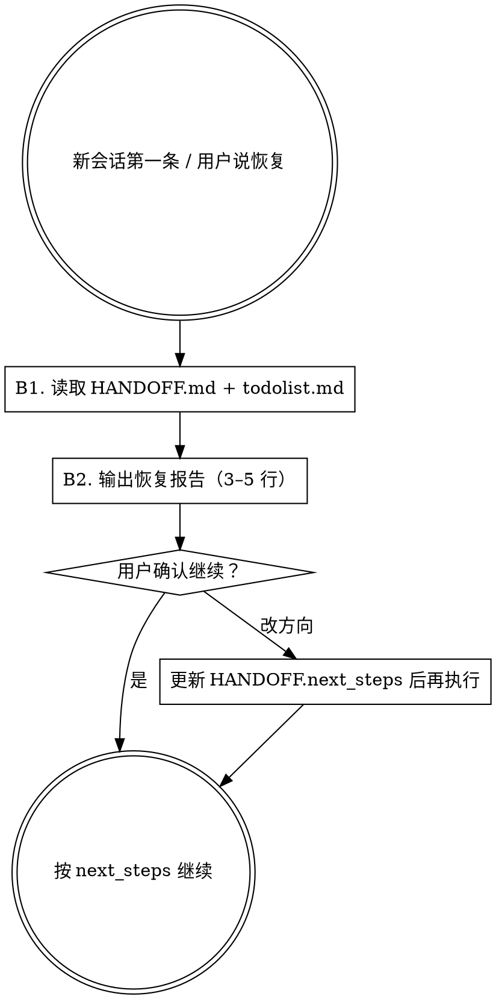

# handoff-bridge — 跨会话交接 skill

## Overview

负责跨 Claude Code session 的"收尾 + 恢复"两件事：

1. **session 收尾**：判定是否需要写 `HANDOFF.md`，生成增量追加内容，软校验，提示提交。
2. **session 恢复**：新会话第一条时读 `HANDOFF.md` + `todolist.md`，输出恢复报告。

**Core principle**：HANDOFF 只承载"跨会话仍生效"的动态状态（任务定位 / 悬念 / 下次入口），业务规则与协议字段必须落到项目长期规则文件，禁止混入 HANDOFF。

**Announce at start**：调用本 skill 时先说一句 `I'm using the handoff-bridge skill to {收尾|恢复} this session.`

## When to use

- 用户说 `/clear`、`清理会话`、`结束这轮`、`交接`、`handoff` —— 走 **流程 A（收尾）**
- 新会话第一条 / 用户说 `恢复上次`、`继续昨天的`、`resume` —— 走 **流程 B（恢复）**

## When NOT to use

- session 持续进行中、没有要中断 —— 不触发，正常工作即可
- 流程 A 的 A1 三信号全不命中 —— 告知"无需 HANDOFF，可直接 clear"并退出
- 业务规则 / 协议字段 / 禁令条款 —— 走项目长期规则文件（如 `.ruler/*`、`CLAUDE.md`），不写 HANDOFF

## Precedence（必须记住）

```
项目 CLAUDE.md > 项目长期规则（如 .ruler/*） > HANDOFF.md > 长期用户画像（如 MEMORY.md）
```

文件分工：

| 文件 | 作用 | 生命周期 |
|---|---|---|
| 项目长期规则（如 `.ruler/*`） | 长期业务规则 / 协议字段 / 禁令 | 永久 |
| `HANDOFF.md` | 跨 session 动态状态（任务定位 + 悬念 + 下次入口） | 每次收尾追加，文件本身长期存在，体积红线 ≤80 行 |
| `todolist.md` | 当轮步骤 + 验收命令 | 当轮收尾后清空（保留 schema 前 4 行） |
| 长期画像（如 `MEMORY.md`） | 跨项目仍有效的决策指针 | 长期存在 |

---

## 流程 A — session 收尾



### A1. 条件自检（三信号任一命中才继续）

执行以下三项，任一命中即进入 A2；全不命中则告知"无需 HANDOFF，可直接 clear"并退出。

```bash
# 信号 1：有未提交改动
git status --porcelain | grep -v '^??' | head -1    # 非空即命中

# 信号 2：todolist 有活条目
grep -E '状态.*:\s*(pending|in-progress|blocked)' todolist.md | head -1

# 信号 3：本轮对话出现悬念关键词（Claude 自评估最近 5 轮）
# 命中词：待批准 / 阻塞 / 等用户确认 / 需要你决定 / 待确认 / approval gate / blocked / waiting
```

### A2. 生成 HANDOFF 增量（先预览，不直接写）

按 4 段 schema 产出追加块，展示给用户审阅。占位符按项目实际填写：

```markdown
## last_session_id

- session_id: {YYYY-MM-DD}-{slug}          # slug = 3–5 字短语
- ended_at: {YYYY-MM-DDTHH:MM:SS{tz_offset}}  # 时区按项目约定
- branch: {当前分支}
- base_branch: {项目基线分支}              # 按项目约定，常见 main / master / develop
- auto_session_summary: {本轮 ≤2 行要点}

## decisions

# 仅记录「跨会话仍生效」的决策，每条 ≤2 行，详情走文件指针
- **{YYYY-MM-DD}** {决策要点}。详见 `{相对路径或锚点}`。

## next_steps

# 与 todolist.md 同步，下次会话恢复路径
- 进行中：{任务 + 所处步骤}
- 下一步：{下一个可执行动作}
- 阻塞：{等待用户或外部的前置条件，无则省略}

## 上次 session 末尾留下的悬念（≤5 行）

- {YYYY-MM-DD HH:MM} — {1–2 行悬念描述 + 等待什么}
```

### A3. 同步 todolist.md（按需）

- 勾掉本轮已完成的步骤（状态改 `done`）
- 标记新发现的阻塞项（状态改 `blocked` 并补原因）
- 若本轮新增复杂任务（>3 步），追加到 todolist 并补验收表格
- 若 todolist 所有项 = `done`，按约定只保留前 4 行 schema 注释，其余清空

### A4. 软校验（grep 自检，硬性结构 + 黑名单 + 体积红线）

```bash
# 必须存在且唯一
grep -cE '^## last_session_id'                     HANDOFF.md   # 期望 =1
grep -cE '^## decisions'                           HANDOFF.md   # 期望 =1
grep -cE '^## next_steps'                          HANDOFF.md   # 期望 =1
grep -cE '^## 上次 session 末尾留下的悬念'          HANDOFF.md   # 期望 =1

# 体积红线（超 80 行要求精简最老条目）
wc -l < HANDOFF.md                                               # 期望 ≤ 80

# 黑名单：业务规则混入检查（关键词按本项目实际业务自定义）
# 示例：如果项目里有协议字段、命令字、加密参数等长期规则，列在这里做拦截
# grep -iE '{业务关键词1}|{业务关键词2}|{协议字段}' HANDOFF.md
# 期望：空

# session_id 格式
grep -E 'session_id:\s*[0-9]{4}-[0-9]{2}-[0-9]{2}' HANDOFF.md   # 期望 ≥1
```

任一项不过 → 向用户展示失败项 + 修正建议 → 修正后再次校验 → 通过后进 A5。

> **黑名单自定义提示**：每个项目都有自己的"不应进入 HANDOFF 的长期规则关键词"（例如某个 IoT 项目可能包含蓝牙协议字段、某个支付项目可能包含密钥字段名）。把这些关键词列进 A4 的 grep 黑名单，能在收尾阶段拦截把长期规则错误混入动态状态的情况。

### A5. 询问提交

完成增量追加与校验后，按项目提交规范询问：

> "HANDOFF.md / todolist.md 已更新并通过软校验。是否 commit & push？（按本项目提交规范）"

若本项目使用 ruler 或类似规则合成工具且本轮触及规则源，提醒用户执行对应的同步命令（如 `ruler apply --agents codex,claude,gemini`）。**如果项目没有这类工具链，本提示可忽略。**

---

## 流程 B — session 恢复



### B1. 读取

```
Read HANDOFF.md   # 全量
Read todolist.md  # 全量
```

### B2. 输出恢复报告（3–5 行，给用户过目）

格式固定为：

```
基于 HANDOFF + todolist 的上次状态：
- 上次 session：{last_session_id.session_id} @ {branch}
- 进行中：{next_steps.进行中}
- 下一步：{next_steps.下一步}
- 阻塞（如有）：{next_steps.阻塞}
- 悬念（如有）：{悬念区最近 1 条}

按此路径继续？
```

等用户确认后再动手；若用户要求改方向，先更新 HANDOFF 的 `next_steps` 再执行。

---

## 判定速查表

| 场景 | 执行 |
|---|---|
| 用户说 `/clear` / "清理会话" / "结束这轮" | 流程 A |
| 用户说 "交接" / "handoff" | 流程 A |
| 新会话 / 用户说 "恢复上次" / "继续昨天的" / "resume" | 流程 B |
| session 持续进行中 | 不触发，继续正常工作 |
| A1 三信号全不命中 | 告知无需 HANDOFF，可直接 clear |
| A4 校验不过 | 拒绝进入 A5，先修正 |

## 边界（本 skill 不做的事）

- 不改项目长期规则文件（需用户另行授权）
- 不自动执行 `git commit`（仅询问）
- 不触发任何规则合成命令（仅提醒）
- 不写业务规则 / 协议字段到 HANDOFF（黑名单拦截）
- 不与多 agent 的 stage handoff（如 team-orchestration 中的 stage 间交接）混用——职能不同

## 安装

把本仓库克隆到下列任一位置即可被 Claude Code 识别：

- **用户级**（全局可用）：`~/.claude/skills/handoff-bridge/`
- **项目级**（仅当前项目可用）：`<项目根>/.claude/skills/handoff-bridge/`

```bash
# 用户级安装
git clone https://github.com/Gizele1/handoff-bridge.git ~/.claude/skills/handoff-bridge

# 项目级安装（在项目根目录执行）
git clone https://github.com/Gizele1/handoff-bridge.git .claude/skills/handoff-bridge
```

## 自定义建议

首次接入新项目时，按需调整以下占位：

1. **`base_branch`**：改成你项目的基线分支名（`main` / `master` / `develop` ...）
2. **`tz_offset`**：改成项目约定的时区偏移（如 `+08:00` / `+00:00` / `-05:00`）
3. **A4 黑名单关键词**：列出"绝对不该进入 HANDOFF 的长期规则关键词"，例如协议字段名、密钥字段名、强约束条款 ID 等
4. **A5 提交规范**：替换成你项目的 commit 约定（Conventional Commits / `[type]subject` / Gitmoji ...）
5. **规则合成工具**：若不使用 ruler / 类似工具，删除 A5 末尾相关提示
